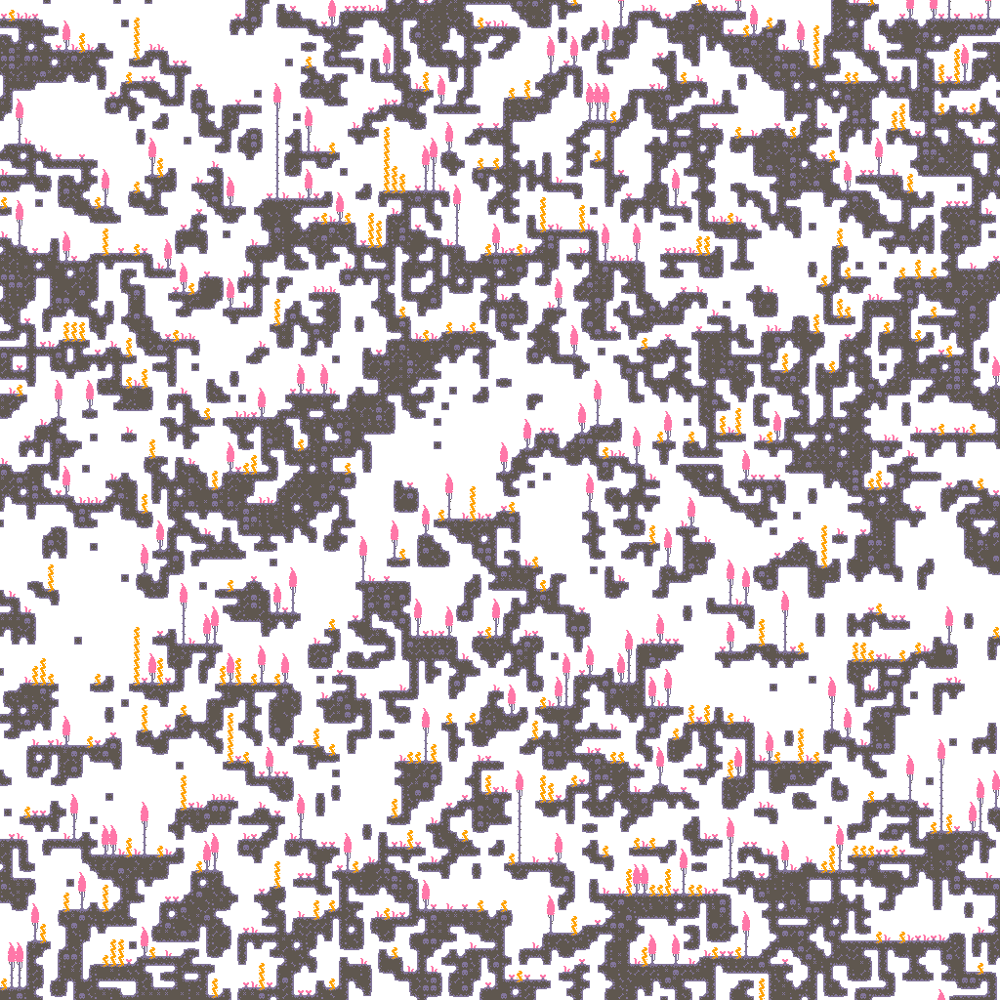

<div align="center">

<h1 align="center">Effektive Blocks</h1>
<h4 align="center">Map generation using wave function collapse in Effekt</h4>




</div>


# Installation & Building

## Prerequisites
- A valid Effekt installation (version >= 0.59)
- A web browser (e.g. Firefox, Chrome)
- A Tile and Ruleset (explained in the web interface)

## Building

```bash
effekt --backend js-web src/main.effekt
```

Depending on your setup and effekt version, you might need to adjust optimizations to speed up compilation:

```bash
effekt --max-inline-size 10 --backend js-web src/main.effekt
```

<details>
<summary>Building with NIX</summary>

You can also use Nix to manage dependencies and build the project:

```bash
nix develop
nix run
nix build
```

</details>

<br>

# Running

After building, you can open the `out/main.html` file in your browser:


### Usage
Provide the following inputs in the web interface:

- Tileset  \
    Image that contains all the tiles you want to use in your map, arranged in a grid. (e.g. 4x6 tiles)
- Ruleset \
    Image that defines which tiles can be placed next to each other based on their edge colors.

    The Ruleset image and the Tileset image should have the same amount of rows and columns.
    You can find a example tileset and ruleset in the [examples](./examples) folder.

- Pixels per Tile \
    Defines how many pixels wide and high each tile is in the tileset (e.g. 32x32 pixels)

- Grid dimensions \
    Defines the world size you want to generate.

- Speed \
    Defines how fast the automatic generation should be

- Manual mode \
    If enabled, you can choose which tile to collapse next manually by clicking on it.


These instructions are also available in the web interface.
